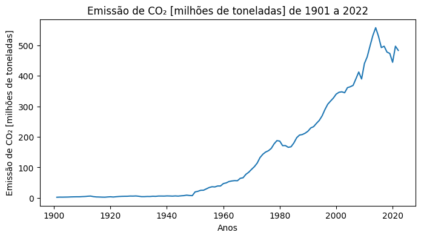
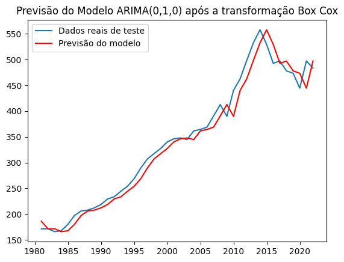
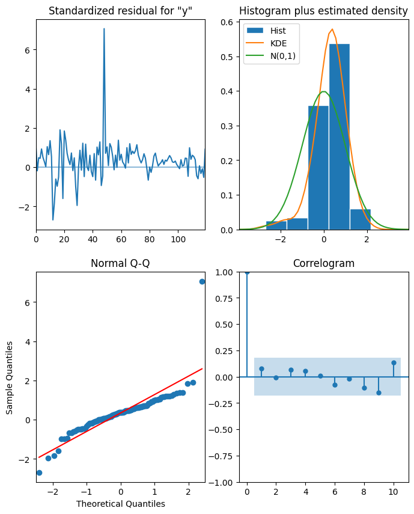
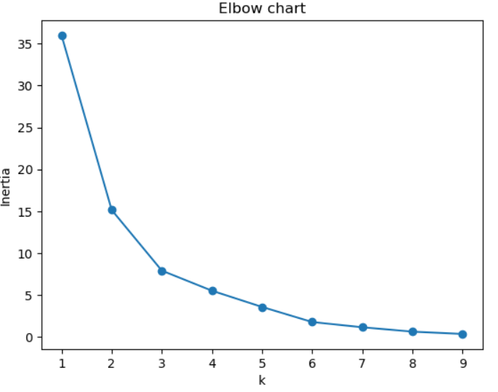
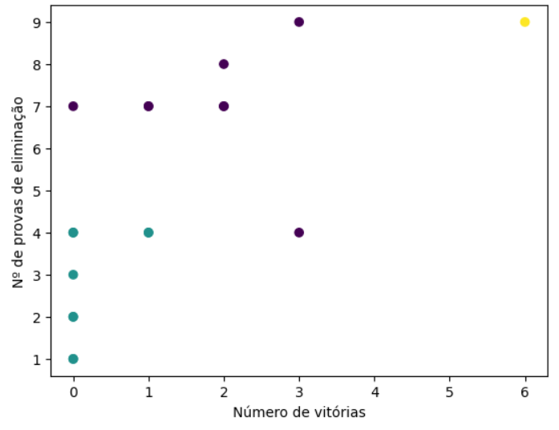

# Portfolio of Data Science and Analytics Projects
## Beatriz Lima
### Data Science & Analytics Specialist

## [Project 1: Modelling and prediction of carbon-dioxide emissions by using ARIMA model](https://github.com/be4lima/ARIMA_CO2_BR)
**Languages**: Python

Develop an ARIMA model to forecast CO2 emissions in Brazil using historical data and analyze the model's performance in predicting future values.

- Time Series Analysis: Conducted stationarity tests, decomposed time series, and applied differencing to achieve stationarity.
- Modeling with ARIMA: Used auto_arima to select optimal parameters, fitted the model to historical data, and performed residual analysis.
- Model Evaluation: Assessed model accuracy using RMSE and MAPE, and validated predictions through a train-test split.
- Outcome: Demonstrated the ARIMA model’s effectiveness in forecasting CO2 emissions and identified areas for future enhancement, such as incorporating exogenous variables.

## [Project 2: K Means Clustering with Masterchef Brasil Data](https://github.com/be4lima/MasterchefBrasil)
**Languages**: SQL and Python

Performed clustering analysis to group contestants based on performance metrics, identifying patterns and similarities among participants.

- SQL Database Creation & Management: Built a SQL database to store and manage Masterchef Brasil 2023 data. Conducted data queries and preprocessing using SQL with mysql-connector in Python.
- Data Preprocessing: Cleaned and prepared the dataset, including handling missing values and normalizing data, to ensure it was ready for clustering analysis.
- Exploratory Data Analysis (EDA): Conducted EDA to understand the distribution of performance metrics and identify potential patterns among contestants.
- Clustering Techniques: Applied K-Means clustering to group contestants into distinct clusters based on their performance, using the elbow method to determine the optimal number of clusters.
- Data Visualization: Visualized clustering results using scatter plots and cluster centroids, making it easier to interpret and present the insights gained from the analysis.
- Interpretation of Results: Analyzed the characteristics of each cluster to understand common traits among contestants and their relationship to overall competition outcomes.

## [Project 3: Data Science applied to Environmental and Urban Engineering](https://be4lima.github.io/TG-Beatriz-Lima/) 
**Languages**: R and R Markdown

Online booklet created to introduce the concepts and applications of Data Science in Environmental and Urban Engineering in the Systems Analysis and Environmental Modeling discipline at the Federal University of ABC (UFABC).

### [Project 3.1: Modeling the relationship between deforestation and GHG emissions in the Brazilian Amazon using a linear regression model](https://be4lima.github.io/TG-Beatriz-Lima/aplica%C3%A7%C3%A3o-1.html)
- Data Collection & Cleaning: Acquired real-world data on deforestation and greenhouse gas (GHG) emissions from INPE, cleaned and prepared the dataset for analysis.
- Exploratory Data Analysis (EDA): Analyzed the relationship between annual deforested area and first-order CO2 emissions, including data visualization to identify trends and correlations.
- Feature Engineering: Developed and selected relevant features to enhance model accuracy, focusing on the relationship between land use change and CO2 emissions.
- Model Implementation & Validation: Built a Linear Regression model, validated its assumptions (linearity, homoscedasticity, normality), and evaluated its performance using R-squared and Mean Absolute Error (MAE).

### [Project 3.2: Geospatial analysis of Fire spots in Brazilian forests](https://be4lima.github.io/TG-Beatriz-Lima/aplica%C3%A7%C3%B5es.html#pontos-de-inc%C3%AAndio-nas-florestas-brasileiras)
  - **Data Acquisition & Cleaning**: Collected and processed geospatial data on forest fire occurrences in Brazil, ensuring data quality for analysis.
  - **Geospatial Data Analysis**: Applied geospatial analysis techniques in R to identify and examine the distribution patterns of fire hotspots across Brazilian forests.
  - **Data Visualization**: Created detailed maps and visualizations to illustrate the concentration and spread of fire incidents, utilizing tools like `ggplot2`, `sf`, and `leaflet` in R.
  - **Statistical Analysis**: Conducted statistical tests to explore correlations between fire occurrences and various environmental factors.

